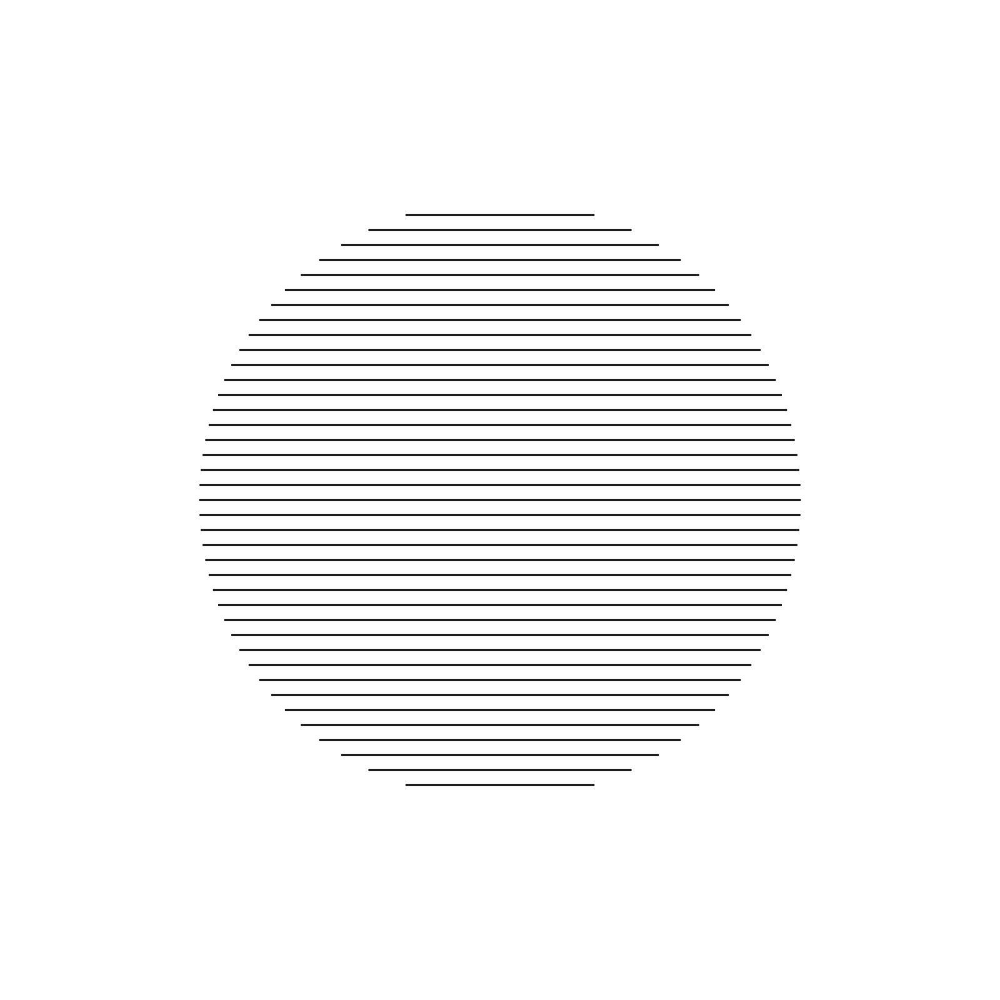
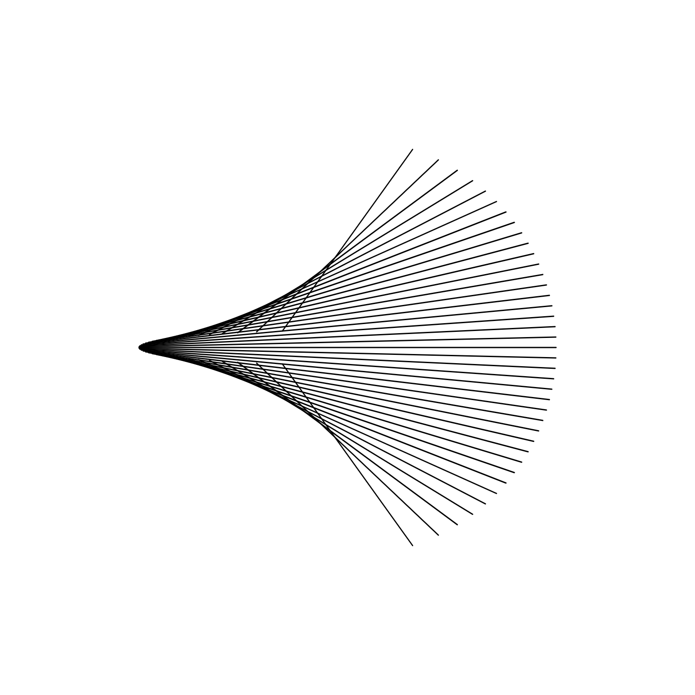
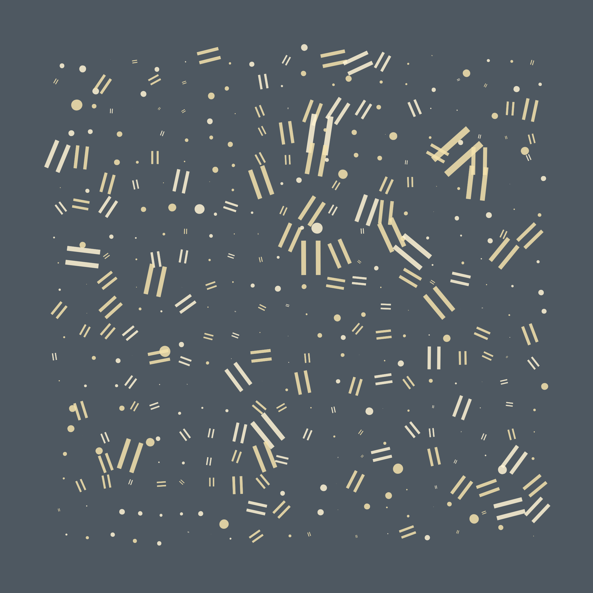

# GENERATIVE SKETCHES 🎨🖌

Daily experimentation with various frameworks and techniques to make generative art.

> Occasionally documentings notes on process / learnings at https://nkravella.github.io/blog.

**Currently working with** `Processing`, `P5.js`, `canvas-sketch`, and `TouchDesigner`  

**Would like to learn** `Three.js`, `WebGL`, `GLSL Shaders`

------------------------------------------------------------------------------------------

* ### 💥[simple grid disruption](./processing/Grid_Basic/Grid_Basic.pde) 

* ### ⊜ [circle as lines](./p5-js/circle_as_lines/p5/sketch.js)

* ### ⊜ [grid with random = & o](./canvas-sketch/GridEquals.js)

